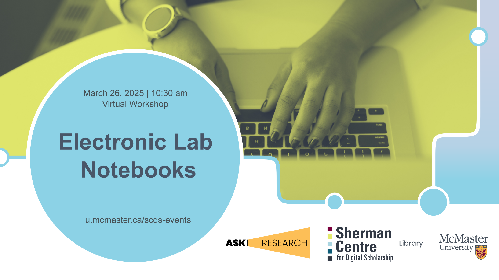

# Electronic Lab Notebooks

This beginner-level session introduces participants to Electronic Lab Notebooks (ELNs), covering common functions, ELN options, and key research considerations.  This workshop will provide guidance on selecting and implementing ELNs for both personal use and within research groups.

By the end of this workshop, participants will understand common features and functions of ELNs as well as the key considerations and tradeoffs involved in ELN selection. Participants will be better equipped to evaluate ELN options and select and implement ELNs to suite their unique research needs.

[Register for this workshop](.){: .btn .btn-outline }

## Workshop Preparation 

None.

## Facilitator Bios

Isaac Pratt (he/him) is a research scientist by training and has a PhD in Anatomy & Cell Biology. He leverages nearly a decade of interdisciplinary research experience to help support students, staff, and faculty. His expertise lies in questions surrounding data storage, security, planning, archival, and sharing. Isaac also provides support and curation services for McMaster Dataverse. His other interests include reproducible research methods, open science, and data science.

Danica Evering holds expansive experience with research support, education, project management, advocacy, and knowledge translation; with fluency in social practice art, healthcare, community research, data, and systems development. Danica supports students, postdocs, faculty, and staff with RDM through the data lifecycle—Data Management Plans, storage and backup, data security, data sharing. With an MA in Media Studies from Concordia, they are interested in fostering RDM within curious scholars and disciplines.

Matthew ""the midnight oil"" Burns (he/him) is the Digital Research Technology Analyst with AskResearch, a collaborative network of support units providing accessible and effective digital research services to the McMaster research community.