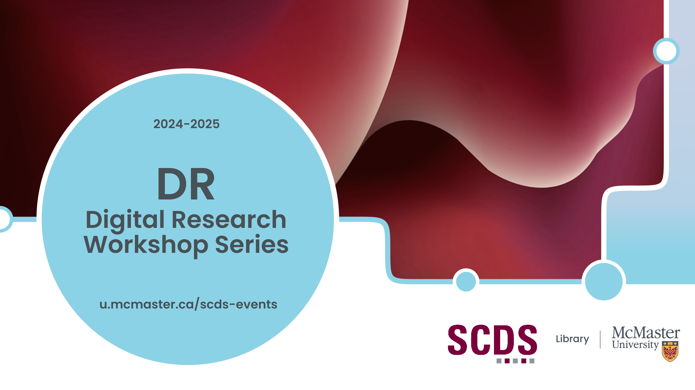



# 2024-2025 Digital Research Workshops

Launched in 2023-2024, Digital Research workshops draw on the expertise of colleagues in the Digital Research Commons Pilot, including the Research Software Development team. Digital Research workshops help registrants with information security, website development, code management, and research impact.

These workshops welcome students, staff, and faculty from any discipline, as well as the public at large. Some are also geared towards beginners, so even if you’re new to digital research, we encourage you to sign up and learn!

## 2024-25 DR Workshops     

  Workshops

<ul>

  
<li><a href="{{workshop.url | absolute_url}}">{{workshop.title}}</a></li>
  

</ul>

