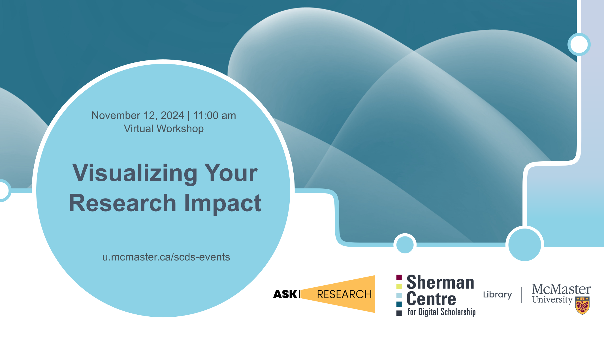

# Visualizing Your Research Impact

The ability to create effective visualizations of your research impact is a valuable skill when competing for grants, awards, and attention in a crowded research landscape.  In this workshop we will explore best practices for generating simple, eye-catching graphics to communicate your impact from a variety of perspectives (from citation rates to collaboration networks to media attention).

Attendees will learn how to: 1) Generate ready-made impact visualizations within a variety of bibliometric tools at McMaster.  2) Utilize raw bibliometric data to create custom visualizations within a variety of tools (Excel, VosViewer, Datawrapper).  3) Effectively incorporate research impact visualizations into reports, grant applications, and award nominations. 

[Register for this workshop](.){: .btn .btn-outline }

## Workshop Preparation 

Review the webinar recording for [Optimizing Research Impact: Establishing and Maintaining Research Profiles](https://learn.scds.ca/dr24-25/researcher-profiles.html).

## Facilitator Bios

Jack Young (he/him) is McMaster’s Research Impact Librarian, supporting the use of bibliometric data to enhance the reporting and strategic planning practices of the University’s academic departments, institutes, and researchers.